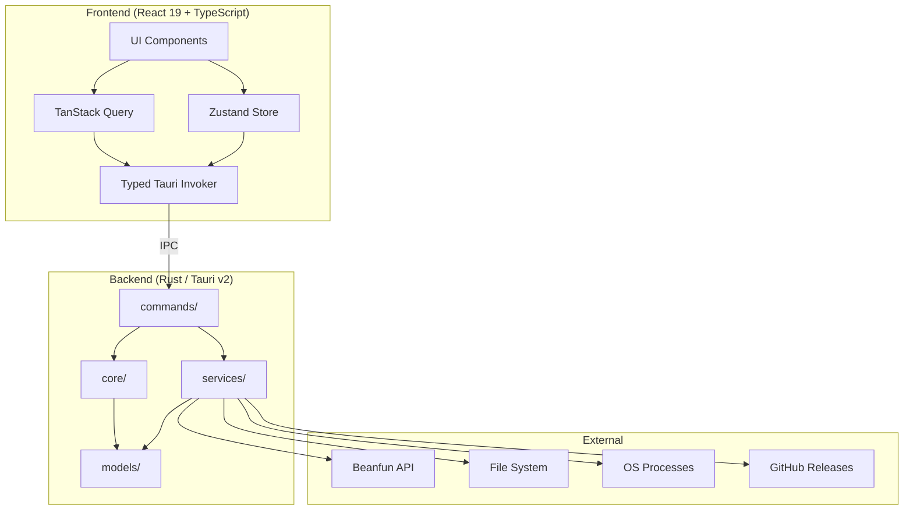
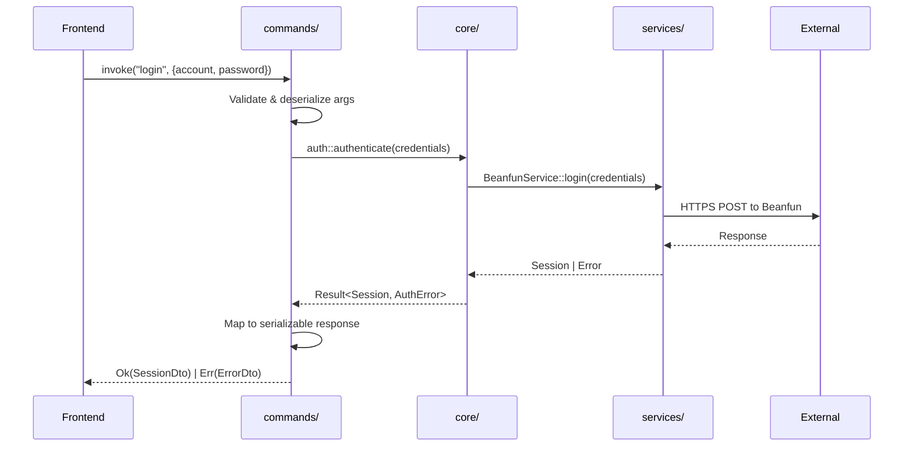

<p align="center">
  
</p>

<h1 align="center">MapleLink</h1>

<p align="center">
  A next-gen third-party Beanfun launcher
</p>

<p align="center">
  <a href="https://github.com/lshw54/maplelink/actions/workflows/ci.yml"></a>
  <a href="https://github.com/lshw54/maplelink/releases/latest"></a>
  <a href="https://github.com/lshw54/maplelink/releases"></a>
  <a href="LICENSE"></a>
</p>

<p align="center">
  <a href="../../releases/latest">Download</a> · <a href="#features">Features</a> · <a href="#architecture">Architecture</a> · <a href="#development">Dev Guide</a> · <a href="README.md">繁體中文</a>
</p>

---

⚠️ **This is NOT an official Gamania product.** Use at your own risk. Make sure you trust where you got this from.

## Why MapleLink?

The original [Beanfun launcher](https://github.com/pungin/Beanfun) served well but was showing its age — .NET WinForms, hard to maintain and extend. MapleLink is a ground-up rewrite built for the long run:
 
- **Rust backend** — all business logic lives in Rust. Session management, OTP, account parsing, DLL injection, process control. No shortcuts.
- **Tauri v2 + WebView2** — lightweight native shell. Small binary, low memory, fast startup.
- **React 19 + Tailwind** — clean, modern frontend with full styling freedom.
- **Clean Architecture** — `commands/` → `core/` → `services/` → `models/`. Structured to stay maintainable as features grow.
- **Single config** — one `config.ini` for both HK and TW regions.

## Features

- Login: account/password, TOTP, QR Code, GamePass, Advance Check verification
- Multi-account management with per-region password saving
- Multi-session support — log into multiple accounts simultaneously in one window (cross-region)
- OTP: one-click retrieve, auto-paste into MapleStory window
- Direct game launch — start the game from the login page without logging in
- Full HK + TW region support
- Dark / Light / System theme, three languages (EN, 繁中, 简中)
- Auto-update via GitHub Releases with automatic proxy detection and fallback (ghproxy.vip / ghproxy.net / ghfast.top)
- Download progress bar — speed, percentage, method display with background download and restart-later option
- Block game auto-update — optionally kill Patcher.exe on launch
- Debug console — real-time log viewer with sensitive data masking, filter/search/copy
- Accelerator-friendly — output binary named Beanfun.exe for UU etc., SSL tolerance
- Locale emulation via [Locale Remulator](https://github.com/InWILL/Locale_Remulator)

## Getting Started

**Requirements:** Windows 10+, [WebView2 Runtime](https://developer.microsoft.com/en-us/microsoft-edge/webview2/) (built into Win11)

1. Grab the latest build from [Releases](../../releases/latest)
2. Install and run

> The `EBWebView` folder in `%APPDATA%` is WebView2's cache — this is normal. Enable "GamePass Incognito Mode" in settings if you don't want it saving login sessions.

## Tech Stack

| Layer | Tech |
|-------|------|
| Backend | [Rust](https://www.rust-lang.org/) + [Tauri v2](https://v2.tauri.app/) |
| Frontend | [React 19](https://react.dev/) + TypeScript |
| Styling | [Tailwind CSS v4](https://tailwindcss.com/) |
| State | [Zustand](https://zustand.docs.pmnd.rs/) + [TanStack Query](https://tanstack.com/query) |
| Locale | [Locale Remulator](https://github.com/InWILL/Locale_Remulator) |

## Architecture

The Rust backend owns all business logic, side effects, and data. The React/TypeScript frontend is a pure presentation layer that invokes Tauri commands and renders state.

### Design Principles

1. **Rust as single source of truth** — validation, auth, config parsing, DLL injection, process management all in Rust. Frontend does no business logic.
2. **Layered architecture** — `commands/` → `core/` → `services/` → `models/`, following Clean Architecture.
3. **INI config round-trip guarantee** — serialize then parse back = identical values.
4. **In-memory-only credentials** — session tokens and passwords never touch disk. Cleared on exit/logout.
5. **DLL integrity check** — SHA-256 verification before Locale_Remulator injection.

<details>
<summary>High-Level Architecture</summary>



</details>

<details>
<summary>Request Flow</summary>



</details>

### Project Structure

```
src-tauri/src/
├── commands/
│   ├── auth.rs                # login, logout, QR, TOTP, GamePass, session management
│   ├── account.rs             # game accounts, OTP retrieval, refresh
│   ├── launcher.rs            # launch game, direct launch, process status
│   ├── config.rs              # config read/write/reset
│   ├── update.rs              # update check, streaming download, restart
│   └── system.rs              # file dialog, version, logging, popup windows
├── core/                      # Pure business logic (auth, config parser, DLL injector, error)
├── services/                  # Side effects (HTTP, file I/O, process management, updates, proxy detection)
├── models/                    # DTOs and domain structs (incl. SessionState for multi-session)
└── utils/                     # Helpers (SHA-256, etc.)

src/
├── features/
│   ├── login/                 # Login page (normal, QR, TOTP, verify)
│   ├── launcher/              # Main page (account grid, OTP, launch)
│   ├── toolbox/               # Toolbox (settings, account manager, about)
│   └── shared/                # Titlebar, status bar, error toast
├── lib/                       # Tauri invoker, i18n, Zustand stores, hooks
├── styles/                    # Tailwind + CSS variables
└── locales/                   # en-US / zh-TW / zh-CN
```

### Pages & Window Sizes

| Page | Size (logical) | Description |
|------|---------------|-------------|
| Login | 340 × 520 | Login forms |
| Main | 750 × 520 | Account grid, OTP, launch button |
| Toolbox | 740 × 480 | Tools, settings, account manager, about |

## Development

```bash
npm install                # install frontend deps
cargo tauri dev            # dev mode (hot reload)
cargo tauri build          # production build
```

### Code Standards

```bash
# Rust
cargo fmt --all            # format
cargo clippy -- -D warnings  # lint

# TypeScript
npm run lint               # ESLint
npm run format             # Prettier

# Git commits follow Conventional Commits
# feat: / fix: / refactor: / chore: ...
```

## Contributing

Fork → branch → test → PR.

## Credits

Inspired by [pungin/Beanfun](https://github.com/pungin/Beanfun).

## License

MIT
