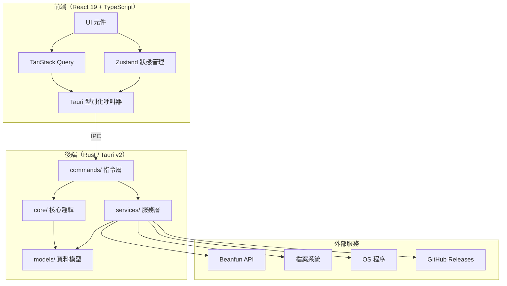

<p align="center">
  
</p>

<h1 align="center">MapleLink</h1>

<p align="center">新世代 Beanfun 第三方啟動器</p>

<p align="center">
  <a href="https://github.com/lshw54/maplelink/actions/workflows/ci.yml"></a>
  <a href="https://github.com/lshw54/maplelink/actions/workflows/build.yml"></a>
  <a href="https://github.com/lshw54/maplelink/releases/latest"></a>
  <a href="https://github.com/lshw54/maplelink/releases"></a>
  <a href="LICENSE"></a>
</p>

<p align="center">
  <a href="../../releases/latest">下載</a> · <a href="#功能特色">功能</a> · <a href="#開發指南">開發</a> · <a href="README.en.md">English</a>
</p>

---

⚠️ **本程式並非遊戲橘子官方產品。** 使用前請自行評估風險，並確認下載來源是否安全。

## 為什麼要做 MapleLink？

原版 [Beanfun 啟動器](https://github.com/pungin/Beanfun) 使用多年，但底層架構已經老舊 — .NET WinForms，不易維護也難以擴充。MapleLink 是從零開始的全新重寫，為長期維護而設計：

- **Rust 後端** — 所有業務邏輯都在 Rust 中處理，包含 session 管理、OTP、帳號解析、DLL 注入、程序控制，沒有捷徑。
- **Tauri v2 + WebView2** — 輕量原生殼層，執行檔體積小、記憶體佔用低、啟動速度快。
- **React 19 + Tailwind** — 簡潔現代的前端，完整的樣式自由度。
- **Clean Architecture** — `commands/` → `core/` → `services/` → `models/`，功能增長時仍保持可維護性。
- **單一設定檔** — 一個 `config.ini`，HK / TW 通用。

## 功能特色

| 分類 | 功能 | 說明 |
|------|------|------|
| 🔐 登入 | 帳號密碼登入 | 支援記住密碼，依地區分別儲存 |
| | TOTP 驗證 | HK 地區雙重驗證 |
| | QR Code 登入 | TW 地區掃碼登入 |
| | GamePass 登入 | TW 地區 GamePass 驗證 |
| | 進階驗證 | 圖形驗證碼自動處理 |
| 👥 帳號 | 多帳號管理 | 帳號列表、右鍵選單、拖曳排序、自訂名稱 |
| | 多 Session 登入 | 同一視窗內同時登入多個帳號，支援跨地區 |
| | 免登入啟動 | 登入頁面直接啟動遊戲，無需先登入帳號 |
| 🎮 啟動 | OTP 一鍵取得 | 取得後自動複製或貼入遊戲視窗 |
| | 區域模擬 | 透過 [Locale Remulator](https://github.com/InWILL/Locale_Remulator) 自動注入 |
| | 阻止自動更新 | 可選擇自動關閉 Patcher.exe |
| 🌍 地區 | HK + TW | 完整支援兩個地區 |
| 🎨 介面 | 主題切換 | 深色 / 淺色 / 跟隨系統 |
| | 多語言 | English、繁體中文、简体中文 |
| | DPI 適配 | 不受 Windows 文字大小設定影響 |
| 🔄 更新 | 自動更新 | 透過 GitHub Releases，自動偵測代理並 fallback |
| | 下載進度 | 顯示速度、百分比，支援背景下載與稍後重啟 |
| 🛠 工具 | 除錯主控台 | 即時 log、敏感資料遮蔽、篩選 / 搜尋 / 複製 |
| | 加速器相容 | 支援 UU 等遊戲加速器，SSL 容錯 |

## 使用方式

**系統需求：** Windows 10 以上、[WebView2 Runtime](https://developer.microsoft.com/en-us/microsoft-edge/webview2/)（Win11 已內建）

1. 前往 [Releases](../../releases/latest) 下載最新版本
2. 安裝後直接執行即可

> `%APPDATA%` 中的 `EBWebView` 資料夾是 WebView2 的快取，屬於正常現象。若不想保留 GamePass 的登入狀態，可在設定中開啟「GamePass 無痕模式」。

## 技術棧

| 層級 | 技術 |
|------|------|
| 後端 | [Rust](https://www.rust-lang.org/) + [Tauri v2](https://v2.tauri.app/) |
| 前端 | [React 19](https://react.dev/) + TypeScript |
| 樣式 | [Tailwind CSS v4](https://tailwindcss.com/) |
| 狀態管理 | [Zustand](https://zustand.docs.pmnd.rs/) + [TanStack Query](https://tanstack.com/query) |
| 區域模擬 | [Locale Remulator](https://github.com/InWILL/Locale_Remulator) |

<details>
<summary>架構設計</summary>

Rust 後端負責所有業務邏輯、副作用與資料管理；React/TypeScript 前端僅負責 UI 呈現與呼叫 Tauri commands。

### 設計原則

1. **所有邏輯都在 Rust** — 驗證、認證、設定解析、DLL 注入、程序管理由後端統一處理，前端只負責畫面
2. **分層架構** — `commands/` → `core/` → `services/` → `models/`，依照 Clean Architecture 劃分職責
3. **設定檔讀寫一致** — INI 設定檔寫入後再讀取，內容保持不變
4. **憑證不落地** — Session token 與密碼只存在記憶體中，登出或關閉程式時立即清除
5. **DLL 注入前先驗證** — 注入 Locale_Remulator 前會以 SHA-256 比對已知雜湊值，確保檔案未被竄改

### 整體架構圖



### 請求流程


### 專案結構

```
src-tauri/src/
├── commands/
│   ├── auth.rs                # 登入、登出、QR、TOTP、GamePass、session 管理
│   ├── account.rs             # 遊戲帳號、OTP 取得、帳號刷新
│   ├── launcher.rs            # 啟動遊戲、免登入啟動、程序狀態
│   ├── config.rs              # 設定讀寫、重設
│   ├── update.rs              # 更新檢查、串流下載、重啟
│   └── system.rs              # 檔案對話框、版本、日誌、彈出視窗
├── core/                      # 純業務邏輯（auth、config parser、DLL injector、error）
├── services/                  # 副作用封裝（HTTP、檔案 I/O、程序管理、更新、代理偵測）
├── models/                    # DTO 與領域結構（含 SessionState 多 session 支援）
└── utils/                     # 工具函式（SHA-256 等）

src/
├── features/
│   ├── login/                 # 登入頁面（帳密、QR、TOTP、驗證）
│   ├── launcher/              # 主頁面（帳號列表、OTP、啟動）
│   ├── toolbox/               # 工具箱（設定、帳號管理、關於）
│   └── shared/                # 標題列、狀態列、錯誤提示
├── lib/                       # Tauri invoker、i18n、Zustand stores、hooks
├── styles/                    # Tailwind + CSS variables
└── locales/                   # en-US / zh-TW / zh-CN
```

### 頁面與視窗尺寸

| 頁面 | 尺寸（邏輯像素） | 說明 |
|------|-----------------|------|
| Login | 350 × 620 | 登入表單 |
| Main | 760 × 530 | 帳號列表、OTP、啟動按鈕 |
| Toolbox | 750 × 490 | 工具、設定、帳號管理、關於 |

</details>

## 開發指南

```bash
npm install                # 安裝前端相依套件
cargo tauri dev            # 開發模式（熱重載）
cargo tauri build          # 正式建置
```

### 程式碼規範

```bash
# Rust
cargo fmt --all --check                    # 格式檢查
cargo clippy --all-targets -- -D warnings  # 靜態分析
cargo test                                 # 單元測試 + 屬性測試

# TypeScript
npm run lint                                       # ESLint 檢查
npx prettier --check "src/**/*.{ts,tsx,css,json}"  # 格式檢查
npx tsc -b                                         # 型別檢查
npm run format                                     # Prettier 格式化

# Git commit 遵循 Conventional Commits
# feat: / fix: / refactor: / chore: ...
```

## 貢獻方式

Fork → 建立分支 → 測試 → 發送 PR。

## 致謝

靈感來自 [pungin/Beanfun](https://github.com/pungin/Beanfun)。

## 授權條款

MIT
