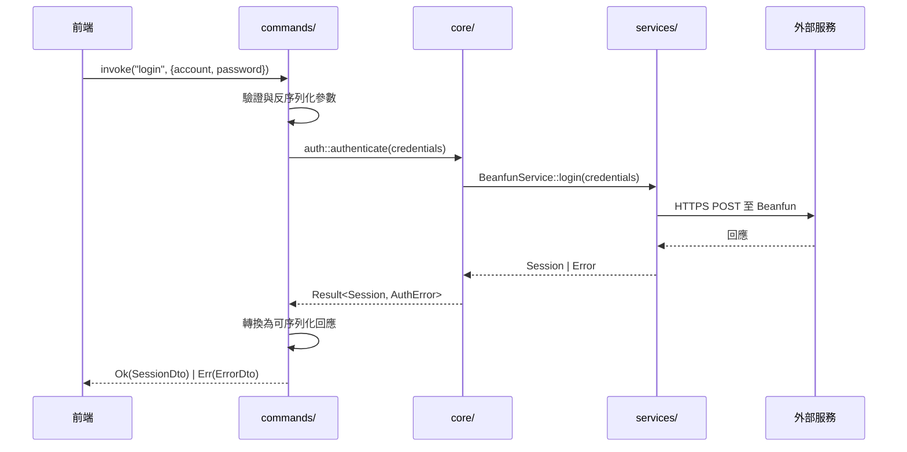

<p align="center">
  
</p>

<h1 align="center">MapleLink</h1>

<p align="center">
  新一代 Beanfun 第三方啟動器
</p>

<p align="center">
  <a href="../../releases/latest">下載</a> · <a href="#功能">功能</a> · <a href="#架構">架構</a> · <a href="#開發">開發</a> · <a href="README.en.md">English</a>
</p>

---

⚠️ **本程式並非遊戲橘子官方產品。** 使用前請自行評估風險，並確認下載來源安全。

## 為什麼做 MapleLink？

原版 [Beanfun 啟動器](https://github.com/pungin/Beanfun) 用了很久，但架構老舊 — .NET WinForms、難以擴展。MapleLink 是完全重寫：

- Rust 後端 — 所有邏輯都在 Rust，session 管理、OTP、帳號解析，零妥協
- WebView2 前端 — React 19 + Tailwind，輕量快速
- 單一設定檔 — 一個 `config.ini`，HK / TW 通用

## 功能

- 登入方式：帳號密碼、TOTP、QR Code、GamePass、進階驗證
- 多帳號管理，按地區記住密碼
- OTP 一鍵取得、自動貼入遊戲視窗
- 完整支援 HK + TW 地區
- 深色 / 淺色 / 跟隨系統主題，三語介面（EN、繁中、简中）
- 自動更新（正式版 / 測試版頻道）
- 相容遊戲加速器（UU 等）的 SSL 容錯
- 透過 [Locale Remulator](https://github.com/InWILL/Locale_Remulator) 自動區域模擬啟動

## 使用方式

**系統需求：** Windows 10 以上、[WebView2 Runtime](https://developer.microsoft.com/en-us/microsoft-edge/webview2/)（Win11 已內建）

1. 到 [Releases](../../releases/latest) 下載最新版
2. 安裝後直接執行

> `%APPDATA%` 下的 `EBWebView` 資料夾是 WebView2 的快取，屬正常現象。如不想保留 GamePass 登入狀態，可在設定中開啟「GamePass 無痕模式」。

## 技術棧

| 層級 | 技術 |
|------|------|
| 後端 | [Rust](https://www.rust-lang.org/) + [Tauri v2](https://v2.tauri.app/) |
| 前端 | [React 19](https://react.dev/) + TypeScript |
| 樣式 | [Tailwind CSS v4](https://tailwindcss.com/) |
| 狀態管理 | [Zustand](https://zustand.docs.pmnd.rs/) + [TanStack Query](https://tanstack.com/query) |
| 區域模擬 | [Locale Remulator](https://github.com/InWILL/Locale_Remulator) |

## 架構

Rust 後端擁有所有業務邏輯、副作用與資料；React/TypeScript 前端純粹負責 UI 渲染與呼叫 Tauri commands。

### 設計原則

1. **Rust 為唯一真相來源** — 驗證、認證、設定解析、DLL 注入、程序管理全部在 Rust，前端不做業務邏輯
2. **分層架構** — `commands/` → `core/` → `services/` → `models/`，遵循 Clean Architecture
3. **INI 設定檔 round-trip 保證** — 寫入再讀取 = 原始值不變
4. **憑證僅存於記憶體** — Session token 與密碼不落地，登出或關閉即清除
5. **DLL 注入前完整性驗證** — 注入 Locale_Remulator 前以 SHA-256 比對已知雜湊值

<details>
<summary>整體架構圖</summary>


</details>

<details>
<summary>請求流程</summary>



</details>

### 專案結構

```
src-tauri/src/
├── commands/
│   ├── auth.rs                # 登入、登出、QR、TOTP、GamePass、session 刷新
│   ├── account.rs             # 遊戲帳號、OTP 取得、帳號刷新
│   ├── launcher.rs            # 啟動遊戲、程序狀態
│   ├── config.rs              # 設定讀寫、重設
│   ├── update.rs              # 更新檢查、套用
│   └── system.rs              # 檔案對話框、版本、日誌、彈出視窗
├── core/                      # 純業務邏輯（auth、config parser、DLL injector、error）
├── services/                  # 副作用封裝（HTTP、檔案 I/O、程序管理、更新）
├── models/                    # DTO 與領域結構
└── utils/                     # 工具函式（SHA-256 等）

src/
├── features/
│   ├── login/                 # 登入頁面（帳密、QR、TOTP、驗證）
│   ├── launcher/              # 主頁面（帳號列表、OTP、啟動）
│   ├── toolbox/               # 工具箱（設定、帳號管理、關於）
│   └── shared/                # 標題列、狀態列、錯誤提示
├── lib/                       # Tauri invoker、i18n、Zustand stores、hooks
├── styles/                    # Tailwind + CSS variables
└── locales/                   # en-US / zh-TW / zh-CN
```

### 頁面與視窗尺寸

| 頁面 | 尺寸（邏輯像素） | 說明 |
|------|-----------------|------|
| Login | 340 × 520 | 登入表單 |
| Main | 750 × 520 | 帳號列表、OTP、啟動按鈕 |
| Toolbox | 740 × 480 | 工具、設定、帳號管理、關於 |

## 開發

```bash
npm install                # 安裝前端依賴
cargo tauri dev            # 開發模式（熱重載）
cargo tauri build          # 正式建置
```

### 程式碼規範

```bash
# Rust
cargo fmt --all            # 格式化
cargo clippy -- -D warnings  # 靜態分析

# TypeScript
npm run lint               # ESLint 檢查
npm run format             # Prettier 格式化

# Git commit 遵循 Conventional Commits
# feat: / fix: / refactor: / chore: ...
```

## 貢獻

Fork → 開分支 → 測試 → 發 PR。

## 致謝

靈感來自 [pungin/Beanfun](https://github.com/pungin/Beanfun)。

## 授權

MIT
